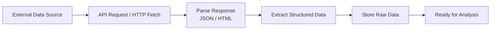

# Lab: Retrieving Data via APIs and Web Scraping  
**Module 8 — APIs and Web Scraping**

**Estimated Time:** 30 minutes

---

## Introduction

In this lab, you will practice **real-world data acquisition** by collecting data from two common external sources:

- **REST APIs** using the `requests` library  
- **Web pages** using `BeautifulSoup` for HTML parsing  

You will learn how to authenticate requests, extract structured information, and store raw data responsibly for later analysis. The focus is not only technical execution, but also **ethical, legal, and reproducible data collection practices**.

This lab mirrors how analysts and data scientists source data outside traditional files.

---
> **Note:** This is a **starter lab**.  
> Local **stub files** are included in the `data/` folder so the lab can be completed even if a live API is unavailable or external data changes.
---

## Learning Objectives

By the end of this lab, you will be able to:

- Retrieve structured data from a REST API using `requests`  
- Authenticate API requests when required  
- Extract and parse HTML data using `BeautifulSoup`  
- Store raw collected data for later analysis  
- Apply ethical and legal considerations to data collection workflows  

---

## Tools & Libraries

You will use:

- Python 3  
- Jupyter Notebook  
- Requests  
- BeautifulSoup  
- Pandas  

---

## Lab Overview

You will follow a structured data-collection workflow:


---
## How to Work Through the Lab

Follow the steps below in order.  
Run each cell as you go and read the markdown instructions carefully.

---

### 1. Set Up Your Notebook

Open the starter notebook:
- notebooks/api_web_scraping_lab.ipynb


In the setup section, you will:

- Import required libraries (`requests`, `bs4`, `pandas`)
- Review the provided starter dataset or API endpoint

---

### 2. Retrieve Data from an API

Using the `requests` library, you will:

- Send an HTTP GET request to a REST API
- Handle authentication (API key or headers, if required)
- Inspect the response status code
- Parse JSON data into Python structures

Focus on understanding the structure of the response before extracting fields.

---

### 3. Extract and Structure API Data

You will:

- Select relevant fields from the API response
- Convert the data into a Pandas DataFrame
- Inspect the structure and contents of the collected data

This step prepares the data for later analysis while keeping it raw and unmodified.

---

### 4. Web Scraping with BeautifulSoup

You will retrieve data from an HTML page by:

- Sending an HTTP request to a webpage  
- Parsing the HTML using **BeautifulSoup**  
- Identifying relevant tags and elements  
- Extracting structured information (e.g. text, tables, links)  

Pay attention to page structure and avoid unnecessary scraping.

---

### 5. Store Raw Data Responsibly

You will:

- Save collected API or scraped data to the `data/raw/` folder  
- Use clear filenames indicating the source and date  
- Preserve raw data without transformations  

Storing raw data separately supports reproducibility and auditability.

---

### 6. Ethical and Legal Considerations

Before finalising your work, reflect on:

- Website terms of service  
- API usage limits and attribution  
- Responsible request frequency  
- Whether scraping is permitted  

Ethical data collection is a core professional responsibility.

---
External data sources can change over time (schemas, availability, rate limits).  
Always validate inputs, handle missing fields gracefully, and design workflows that assume change.

---
### Version Control and Submission

From your project directory, initialise a Git repository and commit your work:

```bash
git init
git add .
git commit -m "Retrieve data via APIs and web scraping"
```
Create a GitHub repository and push your work:

```bash
git branch -M main
git push -u origin main
```
---
> **Important:** When working with live external data, results may vary between runs.  
> Focus on the **process** (requesting, parsing, validating, and storing data), not on matching exact output values.

---
## Tips for Success

- Always inspect responses before parsing  
- Handle errors and unexpected formats gracefully  
- Respect rate limits and usage policies  
- Keep raw data unchanged  
- Document sources clearly in markdown  

---

## Deliverables

Your final submission should include:

- A completed Jupyter Notebook with code and explanations  
- Data retrieved from at least one API or webpage  
- Parsed and structured data stored in `data/raw/`  
- Clear markdown explanations of the data-collection process  
- A GitHub repository containing all project files  

---

## Additional Resources

- **Requests Documentation**  
  https://docs.python-requests.org/

- **BeautifulSoup Documentation**  
  https://www.crummy.com/software/BeautifulSoup/bs4/doc/

- **MDN — Fetching Data from APIs**  
  https://developer.mozilla.org/en-US/docs/Learn/JavaScript/Client-side_web_APIs/Fetching_data

- **Web Scraping Ethics**  
  https://www.scrapingbee.com/blog/web-scraping-ethics/


