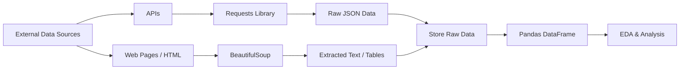
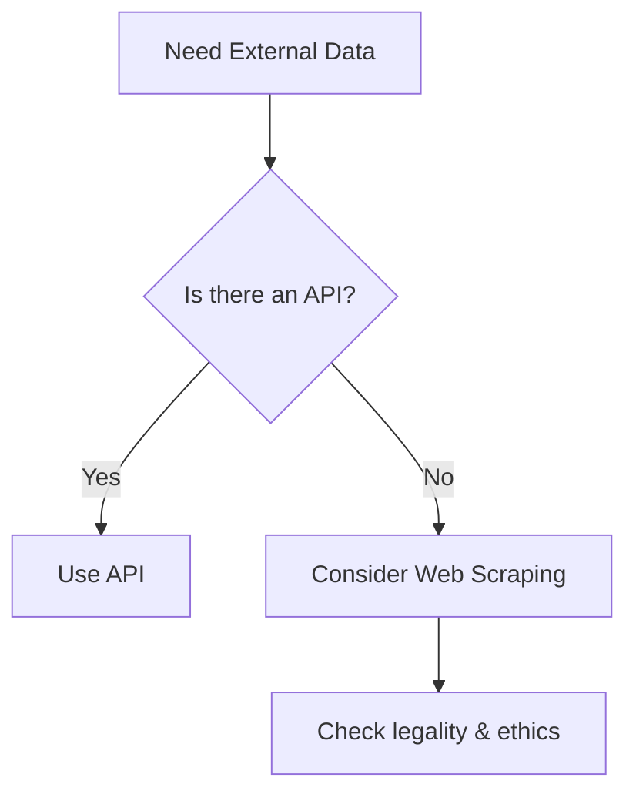

# Module 8 — APIs and Web Scraping

**Session Time:** 120 minutes

---

## Prerequisites

- Python fundamentals (functions, control flow)
- Working with Pandas DataFrames
- Basic understanding of HTTP concepts (requests, responses)
- Comfort working in Jupyter Notebooks
- Completion of **Module 7 — Scientific Computing with SciPy**

---

## Session Breakdown

| Segment | Topic                                           | Duration (minutes) |
|--------:|--------------------------------------------------|--------------------|
| 1       | Introduction to Data Acquisition                 | 10                 |
| 2       | Retrieving Data via APIs (Requests)              | 25                 |
| 3       | API Authentication & Pagination                  | 15                 |
| 4       | Web Scraping with BeautifulSoup                  | 20                 |
| 5       | Ethical & Legal Considerations                   | 10                 |
| 6       | Storing Raw Data for Analysis                    | 10                 |
|         | **Lab — Retrieving Data via APIs and Web Scraping** | **30**             |

---

## Learning Objectives

By the end of this module, you'll be able to:

- Retrieve structured data from APIs using the Requests library  
- Authenticate API requests and handle common response formats  
- Extract and parse HTML content using BeautifulSoup  
- Store raw data for later analysis in reproducible project structures  
- Apply ethical and legal best practices when collecting web data  

---

## What You Will Learn

In this module, you move **upstream in the data pipeline** — from analysing existing datasets to **collecting data from external sources**.

Real-world analytics rarely start with clean CSV files. Instead, data often comes from:

- REST APIs  
- Public web pages  
- Online services and platforms  

You’ll learn how to **programmatically retrieve data**, prepare it for analysis, and store it responsibly for downstream processing with Pandas.

---

## Introduction to Data Acquisition

Data acquisition is the process of **collecting raw data from external systems**.

Common sources include:

- APIs exposed by services and platforms  
- Public websites and HTML pages  
- Open data portals  

Understanding how to retrieve data programmatically allows analysts to:

- Automate data collection  
- Work with up-to-date information  
- Scale analyses beyond static files
  
### Conceptual Data Acquisition Workflow

---
What Is an API?
---------------

An **API (Application Programming Interface)** allows different systems to communicate in a **structured and predictable way**.

Instead of manually downloading files or copying data from websites, APIs let you:

*   Request specific data
    
*   Receive machine-readable responses
    
*   Integrate data directly into your analysis workflows
    

Most modern APIs return data in **JSON format**.

---
### Typical API Workflow

1. Send an HTTP request (GET)
2. Receive a response with a status code
3. Parse JSON into Python objects
4. Convert results into a Pandas DataFrame

Using `requests`, you'll practice this workflow end to end.

---

## Retrieving Structured Data via APIs

APIs (Application Programming Interfaces) allow systems to communicate in a structured way.

Using the `requests` library, you can:

- Send HTTP requests (GET, POST)
- Receive structured responses (JSON)
- Handle status codes and errors

Typical API workflows include:

- Sending a request to an endpoint  
- Parsing the JSON response  
- Converting results into a Pandas DataFrame  

APIs are one of the **most common data sources** in modern analytics workflows.

---

## API Authentication and Pagination

Many APIs require **authentication** to control access.

Common methods include:

- API keys  
- Tokens passed via headers  
- OAuth-based authentication  

APIs may also **paginate results**, meaning data is returned in chunks.

Understanding how to:

- Pass credentials securely  
- Loop through paginated responses  

is essential for collecting complete datasets reliably.

---

## Web Scraping with BeautifulSoup

Not all data is available via APIs.

Web scraping allows you to extract information directly from **HTML pages**.

With BeautifulSoup, you can:

- Parse HTML documents  
- Locate elements using tags, classes, or IDs  
- Extract text, links, and tables  

Web scraping is especially useful when:

- No API exists  
- Data is publicly available on web pages
  

---
## When Is Web Scraping Useful?

- No API exists
- Data is publicly available on web pages
- Information is embedded in page structure

---

## APIs vs Web Scraping — When to Use Which?

**Rule of thumb:**  
If an API exists, prefer the API.

APIs are usually:

- More stable
- Better documented
- Legally safer
---

## Ethical and Legal Scraping Practices

Just because data is accessible does not mean it should be collected indiscriminately.

When scraping data, always consider:

- Website terms of service  
- robots.txt rules  
- Request frequency (rate limiting)  
- Personal or sensitive data  

Ethical data collection ensures:

- Legal compliance  
- Respect for data owners  
- Sustainable and professional analytics practices  

---

## Storing Raw Data for Analysis

Data collected from APIs or web pages should be stored **before transformation**.

Best practices include:

- Saving raw responses (JSON, HTML, CSV)  
- Keeping raw and processed data separate  
- Documenting data sources and collection dates  

Storing raw data ensures your analysis is:

- Reproducible  
- Auditable  
- Easy to reprocess if assumptions change  

---

## Optional AI Reflection Prompt

Using an AI assistant of your choice, ask:

> **“What are the key risks and responsibilities when collecting data from APIs and websites?”**

Use the response to reflect on how ethical considerations influence technical decisions in data projects.

---

## Wrap-Up Reflection

- Why is data acquisition a critical step in analytics workflows?  
- When should APIs be preferred over web scraping?  
- How do ethical considerations shape how data is collected and stored?  

---

## Resources

- **Requests Documentation**  
  https://requests.readthedocs.io/en/latest/

- **BeautifulSoup Documentation**  
  https://www.crummy.com/software/BeautifulSoup/bs4/doc/

- **MDN — HTTP Overview**  
  https://developer.mozilla.org/en-US/docs/Web/HTTP/Overview

- **Real Python — Web Scraping**  
  https://realpython.com/beautiful-soup-web-scraper-python/
